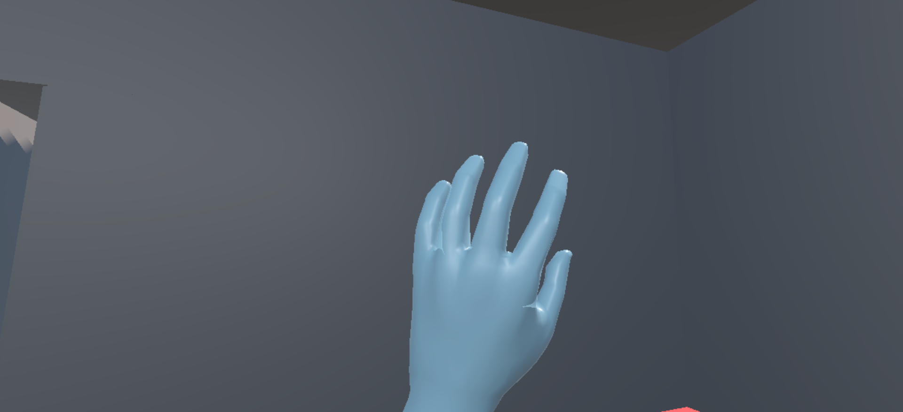
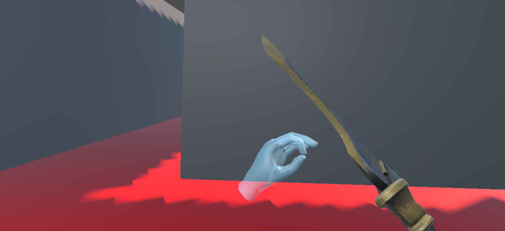
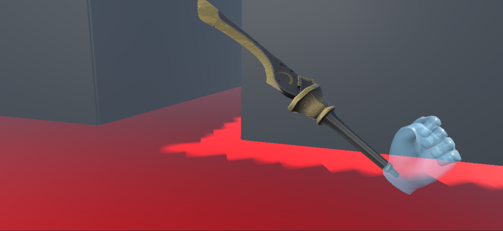

# 2D Platformer Game Assets
### Description
This game utilizes Unity's XR Interaction toolkit plugin to allow for the creation of virtual reality games on Meta Quest and Oculus VR Headsets. Below are some screenshots of the various hand movements I implemented.

This project was created using Unity Version 6000.0.65f1

## Gameplay
# Hand Waving

# Hand Pinch with Sword

# Hand Fist with Sword

